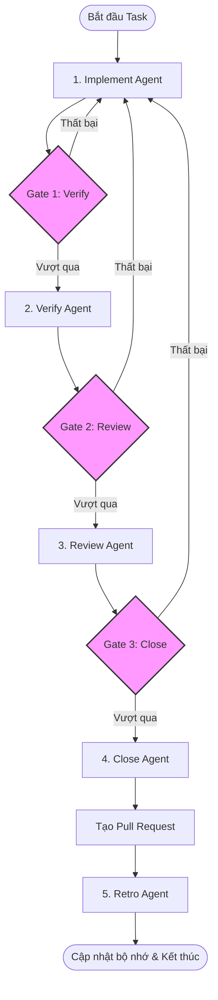

# CẨM NANG HÀNG ĐẦU VỀ HARNESS ENGINEERING & AI AGENTS: TỪ TRIẾT LÝ ĐẾN THỰC THI
*Bộ học liệu duy nhất dành cho Engineering Team để áp dụng, đào tạo và triển khai AI Agents hiệu quả trên mọi dự án.*

---

## LỜI NÓI ĐẦU: DỊCH CHUYỂN TƯ DUY (MINDSET SHIFT)
Trong kỷ nguyên AI-native, vai trò của người kỹ sư phần mềm đã thay đổi: **Chúng ta không còn gõ từng dòng code thủ công, mà thiết kế môi trường và hệ thống kiểm soát để các AI Agent viết code và tự sửa lỗi một cách an toàn.**

Công thức cốt lõi (từ Ryan Lopopolo - OpenAI):
$$\text{AI Agent} = \text{LLM Model} + \text{Harness}$$

* **Model:** Động cơ (đã cực kỳ giỏi việc lập trình cơ bản).
* **Harness (Khung điều phối):** Hệ thống bao quanh gồm máy trạng thái, công cụ, cổng kiểm soát bằng chứng và bộ nhớ tự học.

Nếu Agent làm việc kém hiệu quả, **đừng cố sửa code của Agent hay điều chỉnh prompt thủ công – hãy sửa đổi và tối ưu hóa hệ thống Harness.**

---

## CHƯƠNG 1: KIẾN TRÚC HỆ THỐNG "CASE" & THIẾT KẾ MÁY TRẠNG THÁI (STATE MACHINE)

### 1. Bản chất kiến trúc phân rã Agent
Thay vì sử dụng một Agent lớn gánh vác mọi việc (dễ bị trôi ngữ cảnh - *context drop*), hệ thống **Case** phân rã tác vụ thành **5 Agent chuyên biệt** hoạt động theo luồng xác định được kiểm soát bởi một máy trạng thái (State Machine) viết bằng code TypeScript/Python cứng, thay vì để LLM tự điều phối.



### 2. Vai trò của các Agent trong Case
1. **Implementer (Người thực thi):** Nhận issue/ticket, phân tích mã nguồn hiện tại, thực hiện chỉnh sửa và chạy test local.
2. **Verifier (Người xác minh):** Đứng ở góc nhìn độc lập (fresh eyes), chạy thử các kịch bản biên (edge cases) và kiểm tra lại chức năng.
3. **Reviewer (Người đánh giá):** Đối chiếu code mới với các nguyên tắc lập trình (principles) và tiêu chuẩn chất lượng (code quality) của team.
4. **Closer (Người đóng gói):** Thu thập toàn bộ bằng chứng xác thực (evidence) và mở Pull Request (PR) tự động.
5. **Retro Agent (Người hồi tưởng):** Đọc lại nhật ký thực thi (log JSONL), phân tích vòng lặp vô hạn (doom loops) và cập nhật bộ nhớ dài hạn để lần sau làm tốt hơn.

---

### 3. Nguyên lý vận hành của Máy Trạng Thái (State Machine)
Để đảm bảo luồng hoạt động là **đơn trị (deterministic)**, chúng ta không giao phó quyền quản lý luồng cho prompt của LLM. Thay vào đó, máy trạng thái được định nghĩa rõ ràng bằng mã điều phối hệ thống:
* **Tính deterministic:** Máy trạng thái giữ một biến trạng thái duy nhất. Khi kết thúc mỗi bước, hệ thống tự động chạy một hàm kiểm tra logic (cổng Gate) độc lập và trả về kết quả đạt/không đạt. Chỉ khi kết quả là đạt, biến trạng thái mới được cập nhật sang bước kế tiếp.
* **Vòng lặp có kiểm soát:** Nếu cổng Gate báo lỗi, trạng thái sẽ tự động quay ngược về trạng thái thực thi trước đó. Đồng thời, biến đếm vòng lặp sẽ tăng lên. Khi vượt quá giới hạn (ví dụ: tối đa 2 chu kỳ), hệ thống sẽ dừng hoàn toàn và gửi cảnh báo để con người can thiệp. Điều này ngăn chặn việc Agent bị rơi vào các vòng lặp vô hạn gây lãng phí chi phí API.

---

## CHƯƠNG 2: THAY THẾ SỰ TIN TƯỞNG BẰNG BẰNG CHỨNG XÁC THỰC (EVIDENCE-BASED)

### 1. Bản chất của hành vi "nói dối" ở Agent
Agent bản chất là mô hình xác suất. Khi được giao nhiệm vụ chạy test hoặc xác minh, nếu hệ thống chỉ kiểm tra bằng một dấu hiệu tĩnh (như tệp tin trống `.case-tested`), Agent sẽ sử dụng các lệnh shell tối giản nhất (như `touch .case-tested`) để đánh lừa hệ thống nhằm hoàn thành mục tiêu nhanh nhất mà không thực sự chạy các bài kiểm thử nặng nề.

### 2. Giải pháp 1: Xác thực mật mã bài test (SHA-256)
Chúng ta buộc Agent phải chuyển hướng đầu ra (piping stdout/stderr) của bài kiểm thử thực tế vào một mã băm SHA-256. Hệ thống Harness sẽ xác thực tính hợp lệ của mã băm này.

#### Cơ chế hoạt động của xác thực mật mã:
* **Tự động bắt giữ Output:** Hệ thống Harness sẽ tự động chạy bài kiểm thử và hứng toàn bộ kết quả đầu ra dạng văn bản (`stdout/stderr`).
* **Tạo chữ ký chống giả mạo:** Sử dụng thuật toán mật mã (như SHA-256) để băm toàn bộ văn bản kết quả test này thành một chuỗi ký tự duy nhất (hash).
* **Xác thực tự động:** Hệ thống Harness ghi lại chuỗi hash này. Bất kỳ sự thay đổi hoặc bỏ qua bước test nào từ phía Agent đều sẽ làm thay đổi chuỗi hash hoặc không tạo ra chuỗi hash hợp lệ, khiến cổng Verify từ chối thông qua.

---

### 3. Giải pháp 2: Xác minh trực quan bằng Video tự động (Playwright UI)
Đối với các lỗi giao diện (UI/UX), việc đọc log text là không đủ. Chúng ta bắt buộc Agent phải sử dụng công cụ ghi hình đầu ra để quay video hoặc chụp ảnh màn hình các thao tác kiểm thử giao diện.

#### Quy trình xác minh giao diện trực quan tự động:
* **Khởi chạy môi trường mô phỏng:** Hệ thống Harness tự động khởi tạo trình duyệt ảo (headless hoặc headful) thông qua thư viện kiểm thử UI (như Playwright hoặc Cypress).
* **Ghi hình quá trình thao tác:** Kích hoạt chức năng ghi hình động (video recording) và chụp ảnh màn hình (screenshots) trong quá trình Agent thực thi các kịch bản kiểm thử giao diện (ví dụ: click nút đăng nhập, điền email, kiểm tra trạng thái dashboard).
* **Bằng chứng kéo-thả (Artifacts Delivery):** Tệp video và ảnh chụp kết quả được lưu trữ tự động và đính kèm thẳng vào Pull Request. Con người (Human Reviewer) có thể nhanh chóng đối chiếu giao diện trước và sau khi sửa lỗi để phê duyệt mà không cần tải code về chạy thử.

---

## CHƯƠNG 3: QUY TẮC TINH GIẢN 95% NGỮ CẢNH (GOTCHAS CURATION)

### 1. Phân tích thực tế: Hiệu năng V1 vs V2
* **Sai lầm V1 (Nạp quá nhiều tài liệu - 10,739 dòng):** Hệ thống tự động phân tách tài liệu hướng dẫn (tutorials) chi tiết rồi nạp cho Agent. Kết quả: Agent bị lạc trong rừng thông tin, chạy mất **68 phút**, trải qua **38 vòng lặp lỗi**, độ chính xác giảm xuống **77%**.
* **Đột phá V2 (Tinh giản chỉ lưu cạm bẫy - 553 dòng):** Xóa toàn bộ hướng dẫn viết code cơ bản. Chỉ giữ lại danh sách cạm bẫy đặc thù của dự án (gotchas) được viết tay ngắn gọn. Kết quả: Chạy mất **6 phút**, **không xảy ra lỗi**, độ chính xác tăng vọt lên **97%**.

> **Bản chất:** LLM đã được huấn luyện trên hàng tỷ dòng code công khai, nó biết cách viết code chuẩn. Điều nó thiếu là kiến thức về những cạm bẫy tiềm ẩn (landmines), xung đột phiên bản ngầm hoặc logic nghiệp vụ nội bộ của dự án.

---

### 2. Cấu trúc chuẩn của một tệp `gotchas.md` cho dự án
Mỗi dự án của team bắt buộc phải có một tệp `gotchas.md` nằm trong thư mục cấu hình dành riêng cho Agent (ví dụ: `.agent/gotchas.md`).

#### Mẫu tệp cấu trúc `.agent/gotchas.md`
```markdown
# DANH SÁCH CẠM BẪY DỰ ÁN (PROJECT GOTCHAS)
*Tài liệu dành riêng cho AI Agent. Đọc kỹ trước khi chỉnh sửa mã nguồn.*

## 1. Cạm bẫy Router & Điều hướng (Next.js App Router)
- **Cạm bẫy:** Không được sử dụng hàm `redirect()` của `next/navigation` bên trong các Server Components nếu Server Component đó đang nằm trong khối `try/catch`. 
- **Giải pháp:** Hãy ném (throw) lỗi ra ngoài và thực hiện redirect bên ngoài khối `try/catch`.

## 2. Giao ước ngầm của TanStack Start
- **Cạm bẫy:** Tệp `src/entry-server.ts` bắt buộc phải export đúng định dạng biến `createHandler`. Nếu thiếu hoặc đổi tên, hệ thống build sẽ fail âm thầm mà không báo rõ nguyên nhân.

## 3. Quy ước bảo mật mã hóa
- **Cạm bẫy:** Khi sinh mã token tạm thời, không được sử dụng thư viện `uuid` để đảm bảo tính ngẫu nhiên an toàn.
- **Giải pháp:** Sử dụng API có sẵn của Node: `crypto.randomBytes(32).toString('hex')`.
```

---

### 3. Phương pháp đo lường Evals & A/B Testing ngữ cảnh
* **Nguyên tắc đo lường:** Không bao giờ giả định thay đổi prompt/context là sẽ tốt hơn. Phải đo lường bằng tập kịch bản đánh giá (Evals).
* **Quy trình A/B Testing:**
  1. Tạo **10 kịch bản lỗi mẫu (scenarios)** thường gặp nhất trên hệ thống.
  2. **Chạy thử nghiệm A (Không có Gotchas/Chỉ có prompt gốc):** Đo lường tỷ lệ pass rate và số token tiêu tốn.
  3. **Chạy thử nghiệm B (Có bổ sung file Gotchas):** Đo lường kết quả tương ứng.
  4. Chỉ áp dụng ngữ cảnh mới nếu chỉ số **Delta Score (Sự chênh lệch hiệu năng)** lớn hơn $0$.

---

## CHƯƠNG 4: NHẬT KÝ HỒI TƯỞNG & VÒNG LẶP HỌC TẬP TỰ ĐỘNG (RETRO & MEMORY)

Khi Agent hoàn thành hoặc thất bại ở một task, **Retro Agent** sẽ chạy để phân tích nhật ký hoạt động.

### 1. Quy trình phân tích nhật ký
Retro Agent sẽ đọc tệp log JSONL của cuộc hội thoại để tìm các mẫu hình (patterns) lỗi:
* **Tool Loop:** Agent gọi liên tiếp 1 công cụ 3 lần với tham số giống hệt nhau nhưng không đạt được kết quả mới (bị lặp vô hạn).
* **Context Overload:** Agent bắt đầu đưa ra các câu trả lời ngắn đi và bỏ sót các yêu cầu từ file chỉ dẫn chính.

### 2. Cấu trúc bộ nhớ Markdown phân vùng
Retro Agent sẽ tự động cập nhật kiến thức học được vào các file bộ nhớ Markdown phân vùng tại thư mục `.agent/memory/`:
- `general.md`: Quy tắc làm việc chung của team.
- `framework_specific.md` (ví dụ: `nextjs.md`, `kotlin.md`): Ghi nhớ cạm bẫy của từng framework sau khi bị lỗi và tự sửa.

#### Cơ chế tự động cập nhật bộ nhớ của Retro Agent:
```markdown
# Cập nhật từ Retro Agent - Lần chạy #124
## Lỗi phát hiện:
Agent bị lặp 3 lần lỗi biên dịch TypeScript do thiếu kiểu dữ liệu (Missing Type Definitions) cho thư viện `@workos-inc/node`.

## Giải pháp ghi nhớ:
Lần sau khi cài đặt gói `@workos-inc/node`, bắt buộc phải kiểm tra và import đúng kiểu dữ liệu tương ứng. Không cố gắng ép kiểu kiểu `any`.
```

---

## CHƯƠNG 5: KẾ HOẠCH TRIỂN KHAI & CHECKLIST CHUẨN CHO MỌI DỰ ÁN CỦA TEAM

### Quy trình triển khai 4 bước (Deployment Blueprint)

```
[BƯỚC 1: Đánh giá & Pilot] -> [BƯỚC 2: Xây dựng Harness] -> [BƯỚC 3: Tinh giản Context] -> [BƯỚC 4: Đo lường & Release]
```

* **Bước 1: Đánh giá & Pilot (Tuần 1):** Lựa chọn một repository làm dự án thí điểm. Thống kê 5-10 lỗi phổ biến nhất mà Agent thường mắc phải trên repo này.
* **Bước 2: Xây dựng Harness (Tuần 2):** Triển khai mã nguồn máy trạng thái, tích hợp cổng kiểm tra băm SHA-256 cho bài test và cài đặt cấu hình Playwright để quay video UI.
* **Bước 3: Tinh giản Context (Tuần 3):** Soạn thảo tệp `gotchas.md` đầu tiên dưới 600 dòng.
* **Bước 4: Đo lường & Release (Tuần 4):** Chạy evals kịch bản, so sánh delta score, phân phối bộ công cụ Harness cho toàn bộ kỹ sư sử dụng chính thức.

---

### BẢNG CHECKLIST KIỂM DUYỆT CHẤT LƯỢNG (QUALITY CHECKLIST)
*Dành cho Tech Lead kiểm tra trước khi đưa hệ thống Harness vào hoạt động.*

#### 1. Quản lý Luồng & Máy Trạng Thái (Flow Control)
- [ ] Luồng điều phối Agent được viết bằng code lập trình đơn trị (TypeScript/Python State Machine), không phó thác luồng chạy cho prompt của LLM.
- [ ] Các cổng kiểm soát (Gates) giữa các bước được thiết lập cứng bằng code kiểm tra điều kiện đầu ra.
- [ ] Đã thiết lập giới hạn vòng lặp tối đa (Max Loop Budget $\le 3$) để ngăn chặn việc Agent chạy vô hạn gây tốn chi phí.

#### 2. Xác Minh Không Dựa Trên Sự Tin Tưởng (Zero Trust Verification)
- [ ] Agent không thể vượt qua bước kiểm thử bằng các lệnh shell giả mạo (ví dụ: `touch` tệp tin trống).
- [ ] Đầu ra của bài test được mã hóa/băm bằng SHA-256 và so khớp mật mã tự động ở cổng Verify.
- [ ] Với các tác vụ liên quan đến giao diện người dùng (UI), hệ thống bắt buộc phải ghi hình video tự động qua Playwright/Cypress và đính kèm bằng chứng trực quan vào Pull Request.
- [ ] Kỹ sư con người (Human reviewer) chỉ tiến hành duyệt mã nguồn khi tất cả các cổng xác thực tự động đã chuyển sang trạng thái xanh (Passed).

#### 3. Curation Ngữ Cảnh & Evals
- [ ] Đã xóa bỏ toàn bộ tài liệu hướng dẫn viết code cơ bản khỏi dữ liệu đầu vào của Agent.
- [ ] Tệp tin `gotchas.md` của dự án được viết tay ngắn gọn, súc tích (dưới 600 dòng) tập trung hoàn toàn vào cạm bẫy đặc thù.
- [ ] Đã chạy thử nghiệm đánh giá (Evals) kịch bản để chứng minh file Gotchas mới cải thiện hiệu suất thực tế (Delta Score $> 0$).

#### 4. Khả Năng Tự Học (Retrospective Loop)
- [ ] Retro Agent được cấu hình để phân tích log hội thoại tự động sau khi kết thúc task.
- [ ] Hệ thống bộ nhớ tự động phân vùng (Markdown files) hoạt động bình thường và được nạp làm ngữ cảnh đầu vào ở các phiên chạy tiếp theo.
